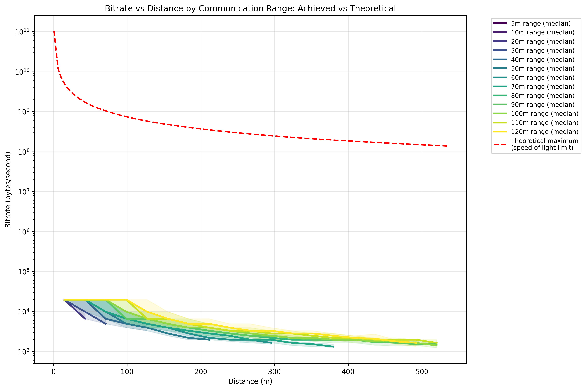

### Simulation background

To calculate theoretical bounds and characterise the delivery statistics of Bluetooth-based communication, we used [The ONE]([http://akeranen.github.io/the-one/) simulator to simulate the testing environment. A large 400x400 L-shape building hall was generated in WKT format to be used by the simulator, and 25 static hosts were randomly placed in it. The distances between all the hosts were evaluated and binned, with a bin width resolution of 5 meters. A simulator run ends when a specific number of randomly generated messages was created for all bins, and then delivered or discarded. We wanted to evaluate the performance of the Bluetooth Low Energy running on [1M PHY](https://www.bluetooth.com/blog/exploring-bluetooth-5-how-fast-can-it-be/) mode, which means a theoretical bitrate cap of [1Mbps](https://dev.ti.com/tirex/explore/node?node=A__AQgtSgkM1Yu1Yimn5wFTOw__SIMPLELINK-ACADEMY-CC23XX__gsUPh5j__LATEST) at $\le1$ meter, assuming free space propagation (we used the Friis Free Space propagation model). The simulation was repeated for 25 times for every configuration. A configuration is composed of some properties: in this part, we chose to examine the affects of the per-node Bluetooth interface communication range parameter: as wireless signals exponentially degrade with distance, but the received signal strength correlates with the transmitted signal strength, we are interested in the trade-off between energy consumption and the deliverability of messages, as well as the achievable bitrate.

### Message Generation
For every simulation run, 1000 messages were generated for every distance bin: the following plot shows a summary of how the message creation distribution varies with range, collected from all runs. We can see a concentration around ~25 meter distance, and a long tail that stretches all the way to ~500  meter.

### Bitrate
Other than the deliverability probabiliy, we are also interested in seeing how the bitrate changes correlate with the distance changes. Each curve in this graph comes from a simulation with the corresponding communication range: $[5, 120]$ meter ranges are visible (the 1m curve is missing due to not having any delivered messages available). 

### Message Deliverability over distance
The following plot shows how the deliverability of messages changes as the communication range increases. Expectedly we see an improvement of the message delivery probability as the communication range increases: between $[1,10]$ meter communication radius barely any messages were able to be delivered; that is due to the fact that 25 hosts were randomly placed on a 400x400m space without movement - if we placed more hosts, the delivery percentage would trivially increase.

### End-to-end Latency
As the latency distribution plot below shows, spending more energy to expand the reliable communication range does not necessarily directly correlate with a higher achieved bitrate: that is due to nodes spending more processing time relaying messages, buffers filling up, and nodes getting overflown with messages. A lower communication range also means less messages are sent, which yields nodes that can more easily process messages; at this point it's worth to mention that the routing technique used is the epidemic routing, where each ndoe forwards each message it receives to all nodes it's connected to, until the destination is found; the epidemic router does not automatically drop messages upon succesful delivery of a node to the intended destination of a message, which leads to the buffer bloat. 

### Effect of node degree on hop latency and count
The following three plots illustrate how the node degree correlates with message hop count, hop latency, and communication range.

The first plot, node degree vs. hop count by communication range, has a curve for each one of the simulated communication ranges, and shows raw values for the node degree (as well as the second plot): in this context, node degree is defined as the number of neighbours each node is connected to; a node is connected to all nodes it is a neighbour of. We can see an expected decrease in message hop count as the communication range increases, with the 120m range showing the highest node degree, and shows the most stable decrease in hop count as node degree increases.
The second plot mainly shows one key point: for most node degrees, the average hop latency does not change, other than outliers around node degrees higher than 12, which are also less statistically significant as the inner quartile range is higher.
The last plot showcases an expected increase in the median node degree as the communication range increases; the median node degree starts being true positive around the communication radius of 40 meters, simply because through the 